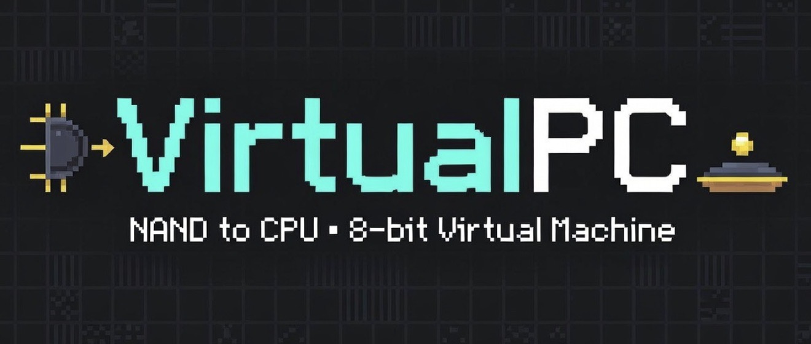

<div align="center">



[](https://python.org)
[](LICENSE)
[](https://github.com/ninjahawk/VirtualPC)
[](https://github.com/ninjahawk/VirtualPC)
[](https://github.com/ninjahawk/VirtualPC)

</div>

The idea: build a real 8-bit computer from the absolute bottom up, starting from a single NAND gate and stacking up through logic gates, an ALU, a CPU, an assembler, and a virtual machine REPL. Memory is backed by a file on disk. Programs are written in a custom assembly language. The AI layer trains a tiny neural network in Python and runs inference natively on the virtual CPU in assembly. You end up with a working machine that can run Pong, compute Fibonacci sequences, and host an AI opponent — all derived from `nand(a, b)`.

**FluxOS** lives one level above all of this. It is a differentiable computer — gates made of learnable logits, trained by gradient descent into logic. You write a training spec; the machine writes itself. Programs are not code. They are compressed experience.

---

## How it works

The repo is deliberately kept small and only really has a handful of files that matter:

- **`gates.py`** — the absolute foundation. Every logic operation (NOT, AND, OR, XOR, MUX) is derived from a single NAND gate. Not modified.
- **`alu.py`** — the 8-bit Arithmetic Logic Unit built from those gates. Implements add, subtract, multiply, shift, and bitwise operations via ripple-carry adders and shift-and-add multipliers. Not modified.
- **`cpu.py`** — the CPU itself. Fetch-decode-execute cycle, registers (A, X, PC, SP), flags (Z, C, N), a full opcode table (~45 instructions), stack, subroutines, and special I/O ops for the pong display. **This file is where new instructions live.**
- **`assembler.py`** — two-pass assembler for the custom assembly language. Supports labels, immediates, `.org`/`.byte`/`.str` directives, and all addressing modes. **Write programs by targeting this.**
- **`vm.py`** — the REPL entry point. Run programs, inspect memory, poke registers, toggle trace mode. **This is what you run.**
- **`trainer.py`** — trains a 3→2→1 ReLU neural network to play Pong and saves quantized weights to `memory.bin`. **This file is edited and iterated on by the human.**
- **`run_ai_pong.py`** — loads saved weights (or trains fresh ones on first run) then executes `ai_pong.asm`, where inference runs natively on the virtual CPU in assembly.

By design, the entire machine fits in your head. The metric the AI opponent optimizes is simple: track the ball. Weights live in `memory.bin` at `$D0–$DA` and persist between runs without any explicit save step.

## Quick start

**Requirements:** Python 3.10+, no other dependencies.

```bash
# 1. Clone the repo
git clone https://github.com/ninjahawk/VirtualPC.git
cd VirtualPC

# 2. Run the virtual machine REPL
python vm.py

# 3. Or run a program directly
python vm.py programs/hello.asm
```

If the above commands all work ok, your setup is working and you can start writing assembly or playing Pong.

## Running the AI Pong

Simply run:

```bash
python run_ai_pong.py
```

On first run the neural net trains from scratch (takes about a second) and saves weights to `.vpc_state/memory.bin`. On every subsequent run the weights are loaded instantly and the AI plays immediately. The `trainer.py` file is essentially the human's side of this setup — point it at new hyperparameters and let it go.

The AI also keeps learning **while you play**. After every rally a small mutation is applied to the weights; if the AI scored, the mutation is kept, and if you scored, it's reverted. You're literally watching a (1+1) evolutionary strategy run in real time. The bottom HUD shows the current generation and the running tally.

Controls: `W`/`S` = your paddle (left) &nbsp;|&nbsp; right paddle = neural net &nbsp;|&nbsp; `Q` = quit.

For pure evolutionary training from random weights (no gradient pre-seed), run `python rl_train.py`. You'll see each generation's population evaluated live before the survivors mutate into the next generation.

## FluxOS — the differentiable computer

FluxOS is a complete computing system built on a different idea: instead of designing logic circuits, you describe what you want and gradient descent builds the hardware.

### The Flux language

Flux is a programming language where you don't write code. You write a training specification.

```flux
# Teach the machine XOR.
learn xor
0 0 -> 0
0 1 -> 1
1 0 -> 1
1 1 -> 0

# Teach a 1-bit full adder.
learn adder adder1

# Run it.
run adder 1 1 1
```

There are no opcodes, no registers, no instruction set. The program IS the training spec. When you `learn`, gradient descent writes gate logits directly into the hardware topology. The result is a trained gate network stored in `.fluxstate/` that persists between runs without any explicit save step.

**The unique angle:** every other programming language describes computation. Flux describes desired behavior and lets the machine figure out how to compute it.

### Built-in topologies

- **Single gate** — 1 SoftGate, 2 inputs, 1 output. Learns any boolean function: NAND, XOR, XNOR, etc.
- **Full adder (`adder1`)** — 5 SoftGates in a fixed ripple-carry topology. The gates discover XOR, AND, OR on their own.
- **8-bit adder** — 40 SoftGates chained for full binary addition.
- **Generic** — 2-layer network for arbitrary I/O shapes.

### Running FluxOS

```bash
# Interactive FluxOS terminal with ANSI interface
python flux_os.py

# With background self-refinement (programs improve while you work)
python flux_os.py --refine

# Run a .flux script directly
python flux.py programs/adder.flux
python flux.py programs/nand_is_dead.flux
python flux.py programs/logic.flux
```

Inside the FluxOS terminal:

```
flux> learn xor
flux> 0 0 -> 0
flux> 0 1 -> 1
flux> 1 0 -> 1
flux> 1 1 -> 0
flux> run xor 1 0
flux> show xor
flux> list
flux> forget xor
```

### How the gate primitive works

Every gate has 4 learnable logits — one per truth-table entry. Given inputs `(a, b)`:

1. Compute bilinear weights: `w = [(1-a)(1-b), (1-a)b, a(1-b), ab]`
2. Compute output: `out = sum(w * sigmoid(logits))`
3. Gradient flows backward through the bilinear interpolation to each logit.

This is exact on `{0,1}` (same as boolean logic), smooth everywhere (differentiable), and universal (any function is representable). A gate at training time is soft. A gate after convergence is hard — the logits saturate and output approaches `{0, 1}`.

### Self-rewriting programs

With `--refine`, FluxOS spawns a background thread running a (1+1) evolutionary strategy over every loaded program. Between your commands, each program gets a random weight perturbation; if sharpness improves, the mutation is kept. Programs sharpen themselves while you use the machine. The wallpaper shows live sharpness bars.

### Flux program examples

```
programs/logic.flux         -- learns XOR, AND, OR from scratch
programs/adder.flux         -- learns a 1-bit full adder, verifies all 8 inputs
programs/nand_is_dead.flux  -- learns NAND, XOR, XNOR, adder1 in one script
```

---

## Project structure

```
gates.py        — NAND-complete logic gate library (foundation, do not modify)
alu.py          — 8-bit ALU built from gates (do not modify)
cpu.py          — CPU, opcode table, fetch-decode-execute cycle
assembler.py    — two-pass assembler for the custom assembly language
memory.py       — 256-byte file-backed memory (no RAM)
vm.py           — REPL entry point
trainer.py      — neural net trainer (gradient descent, human modifies this)
rl_train.py     — evolutionary trainer (random weights -> 100% in seconds)
simulate.py     — headless AI evaluator (36 deterministic serve angles)
run_ai_pong.py  — persistent AI Pong runner with live in-game evolution
soft_gate.py    — SoftGate primitive and GateNetwork (differentiable logic)
flux.py         — Flux language interpreter and REPL
flux_os.py      — FluxOS: ANSI terminal, live wallpaper, background refiner
diff_cpu.py     — differentiable soft-gate demonstration and experiments
programs/       — example assembly programs and .flux scripts (see below)
```

## Example programs

Assembly programs live in `programs/` and can be run with `python vm.py programs/<name>.asm`.

```
hello.asm        — print "hello, world"
count.asm        — count 0 to 9
add.asm          — read two numbers, print their sum (with overflow indicator)
multiply.asm     — read two numbers, print product (uses gate-level MUL)
fibonacci.asm    — read n, print the first n Fibonacci numbers
factorial.asm    — read n, print n! (8-bit; wraps past 5!)
countdown.asm    — read n, count down to "blastoff!"
guess.asm        — number guessing game with higher/lower hints
sierpinski.asm   — Pascal's triangle mod 2, drawn live via gate-level XOR
pong.asm         — two-player pong (W/S vs O/L)
ai_pong.asm      — pong with the in-CPU neural net opponent
```

Flux programs live in `programs/` and can be run with `python flux.py programs/<name>.flux`.

```
logic.flux          — learns XOR, AND, OR from examples
adder.flux          — learns a 1-bit full adder, inspects each gate's discovered logic
nand_is_dead.flux   — learns NAND, XOR, XNOR, adder1; runs and verifies all
```

## Design choices

- **NAND-complete foundation.** Everything — addition, subtraction, multiplication, shifts — is ultimately derived from `nand(a, b)`. This is not a performance choice; it is a pedagogical one. The CPU is intentionally slow. The point is that every operation traces back to a single gate with no shortcuts taken anywhere in the stack.
- **File-backed memory.** The 256-byte address space is backed entirely by a file on disk (`memory.bin`). There is no in-process RAM. Machine state persists across runs without any explicit save step, and neural net weights written by the trainer are immediately visible to the CPU on next boot.
- **Harvard architecture.** Code lives in a separate store inside the CPU object; data lives in `memory.bin`. Programs of any length cannot corrupt their own data, and the two address spaces never collide regardless of program size.
- **Single-file assembler.** The two-pass assembler handles labels, all numeric bases (`$hex`, `%binary`, decimal), string literals, and `.org` directives in a single file with no dependencies beyond the opcode table in `cpu.py`. Writing a new program means writing a `.asm` file; no toolchain required.
- **Neural net inference in assembly.** The matrix-vector multiply, ReLU activations, and sign-of-output decision for the Pong AI run entirely in the custom assembly language on the virtual CPU. Weights are quantized to signed 8-bit integers and stored in `memory.bin`. The trainer is the only Python that touches the network; everything else is assembly running on a CPU built from NAND gates.
- **Differentiable gates (FluxOS).** SoftGate uses bilinear interpolation over 4 learnable logits — exact on boolean corners, smooth everywhere, universally approximating any 2-input 1-output function. Gradient descent discovers logic rather than being told what circuit to wire. No gate type is fixed; no topology is hand-designed beyond the stage count.

## Testing

```bash
# Virtual CPU test suite (1726 tests)
python test_diff_cpu.py

# FluxOS test suite (1329 tests)
python test_flux.py
```

Both test suites run in pure Python with no dependencies and produce a pass/fail count at the end.

## Platform support

This code requires Python 3.10+ and runs on Windows, macOS, and Linux with no additional dependencies. The pong display uses ANSI escape codes; on Windows, ANSI support is enabled automatically via the Console API. Key input uses `msvcrt` on Windows and `termios`/`select` on POSIX — both paths are wired up in `cpu.py` and selected at runtime.

If you are running in an environment without a real terminal (e.g. some CI runners or headless IDEs), `DRAW`, `KEY`, and `WAIT` instructions will still execute but the display may not render correctly. All other instructions work unconditionally in any environment.

Seeing as the whole machine is pure Python with no native extensions, it runs fine on any hardware including low-end laptops and Raspberry Pis. It is just slow — a program that takes microseconds on real silicon may take milliseconds here. That is the point.

## License

MIT
